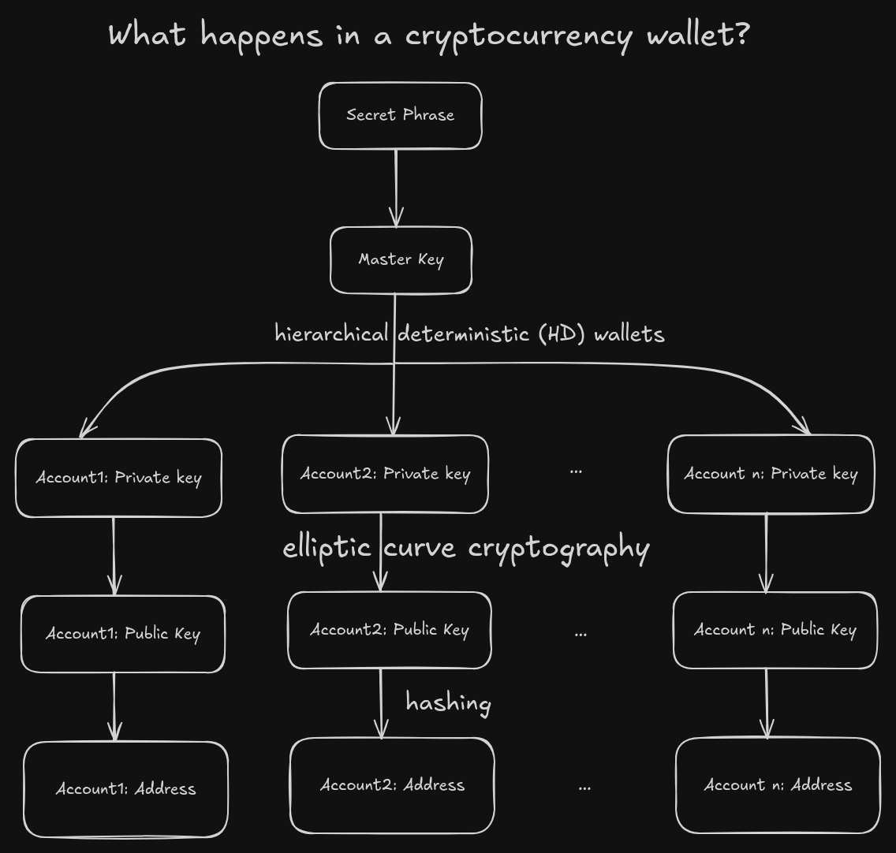

# Digital signatures
[Digital Signatures](../bitcoin.md#Digital%20Signatures) are used to sign and verify transactions.
## In a wallet
1. A wallet is created with a secret phrase.
2. A master key is derived using that secret phrase.
3. Using that master key, multiple accounts can be created.
   We get private keys of those accounts by adding some more data to the master key and then applying hash function on it.
4. Using these private keys, public keys using elliptic curve cryptography.
5. Address is the hashed version of public key.
To conclude, if the secret phrase is stolen, all accounts are stolen since private keys created are predictable with the master key. If only private key of an account is stolen, only that specific account is stolen.  

